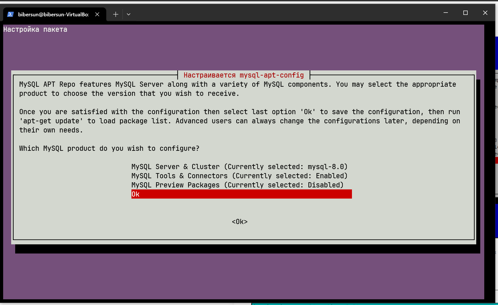

### Создание файла Pets

bibersun@bibersun-VirtualBox:~$ cat > Pets
Fido, Dog, 2020-01-01, Sit, Stay, Fetch
Whiskers, Cat, 2019-05-15, Sit, Pounce
Hammy, Hamster, 2021-03-10, Roll, Hide
Buddy, Dog, 2018-12-10, Sit, Paw, Bark
Smudge, Cat, 2020-02-20, Sit, Pounce, Scratch
Peanut, Hamster, 2021-08-01, Roll, Spin
Bella, Dog, 2019-11-11, Sit, Stay, Roll
Oliver, Cat, 2020-06-30, Meow, Scratch, Jump
^C

### Проверка создания и наполнения файла Pets

bibersun@bibersun-VirtualBox:~$ cat Pets
Fido, Dog, 2020-01-01, Sit, Stay, Fetch
Whiskers, Cat, 2019-05-15, Sit, Pounce
Hammy, Hamster, 2021-03-10, Roll, Hide
Buddy, Dog, 2018-12-10, Sit, Paw, Bark
Smudge, Cat, 2020-02-20, Sit, Pounce, Scratch
Peanut, Hamster, 2021-08-01, Roll, Spin
Bella, Dog, 2019-11-11, Sit, Stay, Roll
Oliver, Cat, 2020-06-30, Meow, Scratch, Jump

### Создание файла Pack_animals

bibersun@bibersun-VirtualBox:~$ cat > Pack_animals
Thunder, Horse, 2015-07-21, Trot, Canter, Gallop
Sandy, Camel, 2016-11-03, Walk, Carry Load
Eeyore, Donkey, 2017-09-18, Walk, Carry Load, Bray
Storm, Horse, 2014-05-05, Trot, Canter
Dune, Camel, 2018-12-12, Walk, Sit
Burro, Donkey, 2019-01-23, Walk, Bray, Kick
Blaze, Horse, 2016-02-29, Trot, Jump, Gallop
Sahara, Camel, 2015-08-14, Walk, Run
^C

### Проверка создания и наполнения файла Pack_animals

bibersun@bibersun-VirtualBox:~$ cat Pack_animals
Thunder, Horse, 2015-07-21, Trot, Canter, Gallop
Sandy, Camel, 2016-11-03, Walk, Carry Load
Eeyore, Donkey, 2017-09-18, Walk, Carry Load, Bray
Storm, Horse, 2014-05-05, Trot, Canter
Dune, Camel, 2018-12-12, Walk, Sit
Burro, Donkey, 2019-01-23, Walk, Bray, Kick
Blaze, Horse, 2016-02-29, Trot, Jump, Gallop
Sahara, Camel, 2015-08-14, Walk, Run

### Объединение файлов в файл Animal

bibersun@bibersun-VirtualBox:~$ cat Pack_animals Pets > Animal

### Просмотр файла Animal

bibersun@bibersun-VirtualBox:~$ cat Animal
Thunder, Horse, 2015-07-21, Trot, Canter, Gallop
Sandy, Camel, 2016-11-03, Walk, Carry Load
Eeyore, Donkey, 2017-09-18, Walk, Carry Load, Bray
Storm, Horse, 2014-05-05, Trot, Canter
Dune, Camel, 2018-12-12, Walk, Sit
Burro, Donkey, 2019-01-23, Walk, Bray, Kick
Blaze, Horse, 2016-02-29, Trot, Jump, Gallop
Sahara, Camel, 2015-08-14, Walk, Run
Fido, Dog, 2020-01-01, Sit, Stay, Fetch
Whiskers, Cat, 2019-05-15, Sit, Pounce
Hammy, Hamster, 2021-03-10, Roll, Hide
Buddy, Dog, 2018-12-10, Sit, Paw, Bark
Smudge, Cat, 2020-02-20, Sit, Pounce, Scratch
Peanut, Hamster, 2021-08-01, Roll, Spin
Bella, Dog, 2019-11-11, Sit, Stay, Roll
Oliver, Cat, 2020-06-30, Meow, Scratch, Jump

### Переименование файла и вывод содержимого папки

bibersun@bibersun-VirtualBox:~$ mv Animal HumanFriends.txt
bibersun@bibersun-VirtualBox:~$ ls
 docker-compose.yml   Pack_animals   snap    Документы   Изображения   Общедоступные   Шаблоны
 HumanFriends.txt     Pets           Видео   Загрузки    Музыка       'Рабочий стол'

### Создание папки и перемещение туда файла

bibersun@bibersun-VirtualBox:~$ mkdir test
bibersun@bibersun-VirtualBox:~$ mv HumanFriends.txt test/
bibersun@bibersun-VirtualBox:~$ cd test
bibersun@bibersun-VirtualBox:~/test$ ls
HumanFriends.txt

### установка из отдельного репозитория

https://dev.mysql.com/downloads/
https://dev.mysql.com/downloads/repo/apt/
здесь берем имя последнего пакета, затем 
cd /tmp wget -c https://dev.mysql.com/get/mysql-apt-config_0.8.29-1_all.deb
ls -fla | grep mysql

### проверим

bibersun@bibersun-VirtualBox:/tmp$ cd
bibersun@bibersun-VirtualBox:~$ cd /etc/apt/sources.list.d/
bibersun@bibersun-VirtualBox:/etc/apt/sources.list.d$

sudo nano mysql.list

содержимое:

  GNU nano 6.2                                           mysql.list                                                     
###THIS FILE IS AUTOMATICALLY CONFIGURED###

 #You may comment out entries below, but any other modifications may be lost.

 #Use command 'dpkg-reconfigure mysql-apt-config' as root for modifications.

deb [signed-by=/usr/share/keyrings/mysql-apt-config.gpg] http://repo.mysql.com/apt/ubuntu/ jammy mysql-apt-config
deb [signed-by=/usr/share/keyrings/mysql-apt-config.gpg] http://repo.mysql.com/apt/ubuntu/ jammy mysql-8.0
deb [signed-by=/usr/share/keyrings/mysql-apt-config.gpg] http://repo.mysql.com/apt/ubuntu/ jammy mysql-tools
#deb [signed-by=/usr/share/keyrings/mysql-apt-config.gpg] http://repo.mysql.com/apt/ubuntu/ jammy mysql-tools-preview
deb-src [signed-by=/usr/share/keyrings/mysql-apt-config.gpg] http://repo.mysql.com/apt/ubuntu/ jammy mysql-8.0

### далее

sudo apt-get update 
sudo apt-get install mysql-server (по дороге вводим пароль для рута)

### установка nginx

sudo apt update
sudo apt upgrade

sudo apt-get download nginx
sudo dpkg -i nginx_1.18.0-6ubuntu14.4_amd64.deb — не хватает пакетов
sudo apt install nginx-core nginx-full nginx-light nginx-extras — добавляем отсутствующие пакеты

sudo apt --fix-broken install — фиксируем ошибки

### удаление nginx

sudo apt-get purge -y nginx
sudo apt autoremove

